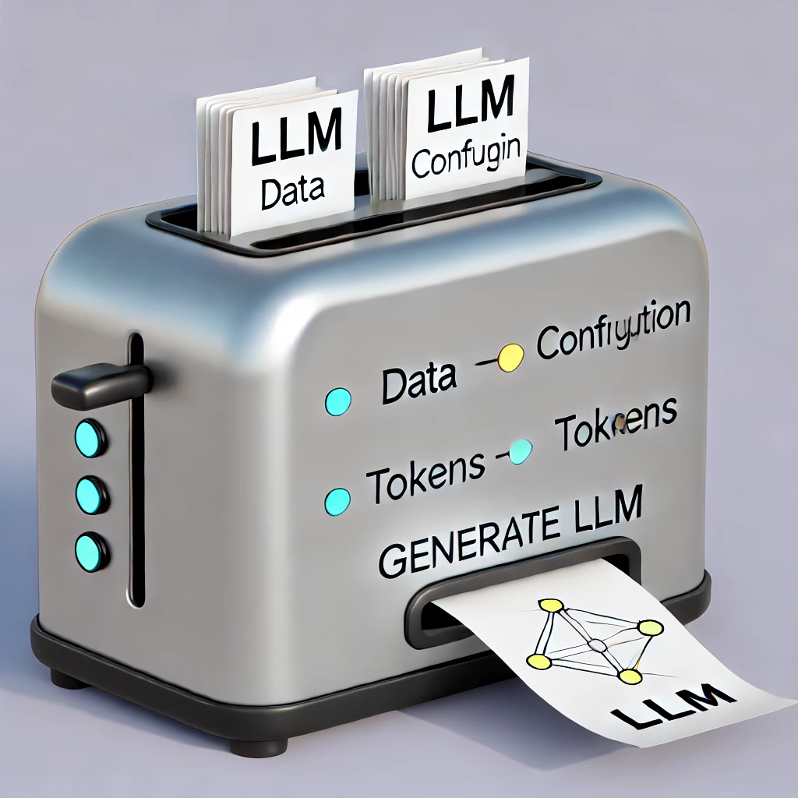

# LLM Toaster



## Overview
LLM Toster is a library designed for training, fine-tuning, and running inference on Transformer-based language models. It streamlines the process of dataset loading, model configuration, and execution.

## Installation
To install the LLM Toster library, navigate to the root directory and run the following command:
```bash
pip install -e .
```
This will install all necessary packages and dependencies.

## Configuration
All configurations can be found in the `llm_toaster/config` directory. Ensure to review and modify these configurations according to your setup and requirements.

## Training
### Step 1) data download and tokenization
To download and tokenize the [fineweb-edu](https://huggingface.co/datasets/HuggingFaceFW/fineweb-edu) dataset from Hugging Face, navigate to the `dataspace/src` directory and run:
```bash
python download_tokenize_hf.py
```
This command will take a file to download and tokenize about 27GB (after tokenization, the size will be reduced to about 10GB)

### Step 2) Training
To train the model, navigate to the `llm_toaster` directory and run:
```bash
python trainer.py
```
### Step 3) Continue training 
You can decide to stop the training and continue afterwards. 
To continue training from the last checkpoint run: 
```
python trainer.py -ct
```
NOTE: progress is saved only during a checkpoint which is automatically taken when the loss is reduced. 

## Inference
### Option 1) Train your model
If you just trained your model, then run the following script to extract the model from the checkpoint (a checkpoint consists of a model, an optimizer, and a scaler)
```
python extract_inference_model.py
```
This will extract the model from a checkpoint saved in `model/checkpoints` and save it under the `model/babyGPT`
### Option 2) Download a pretrained model
You can download a pretrained babyGPT model from [HERE](https://huggingface.co/AmjadMajid/BabyGPT/tree/main) and save it under `llm_toaster/model/babyGPT` directory. 
To prompt the model, use the following command:
```bash
python inference.py -p="Your prompt here"
```
You can continue interacting with the model by providing new prompts, or type `exit` to quit.

## Troubleshooting
If you encounter any issues, please check the following:
- Ensure all dependencies are installed.
- Verify the configurations in `config/config.yaml`.
- Make sure the dataset is downloaded and tokenized correctly.

## Contributing
Contributions are welcome! Please fork the repository and submit a pull request with your improvements or bug fixes.

## License
LLM Toster is released under the MIT License. See `LICENSE` for more details.
