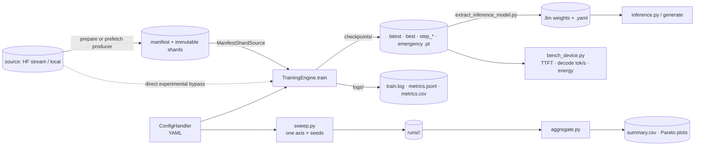
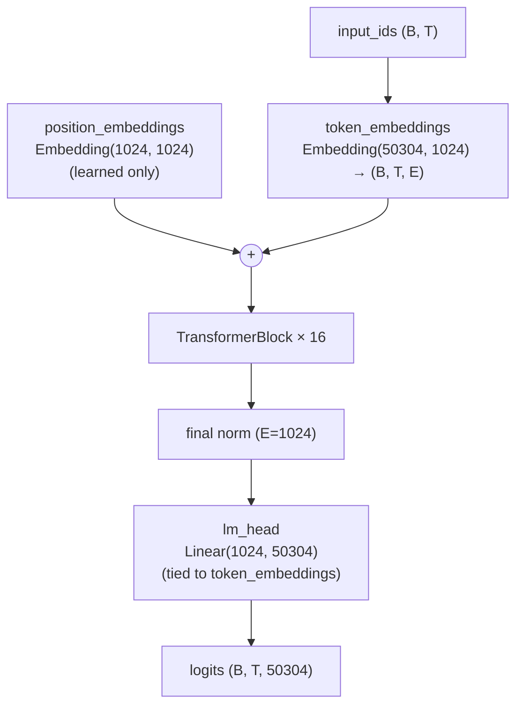
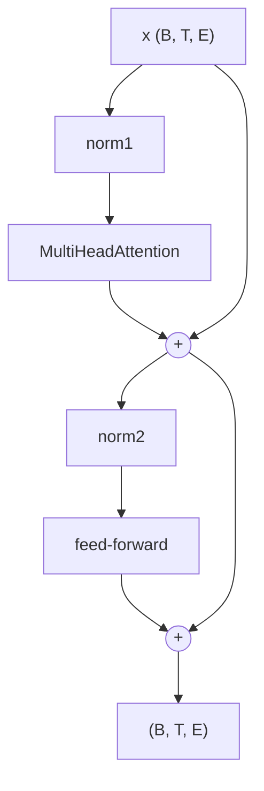
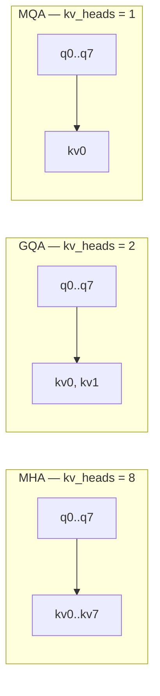
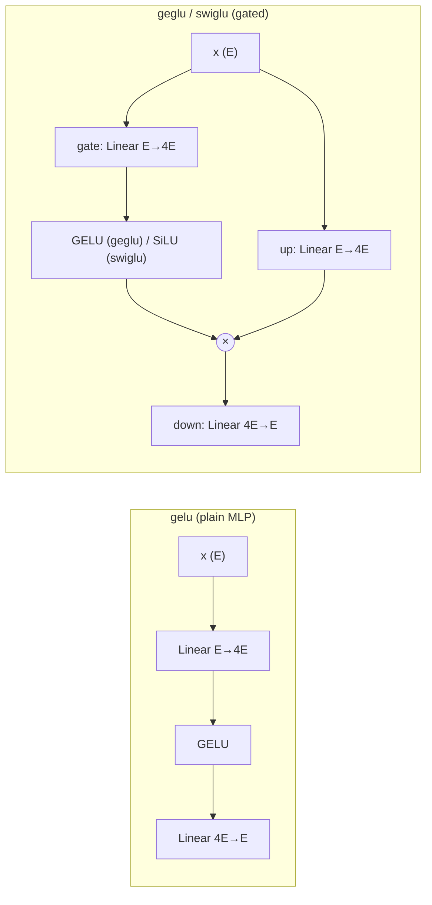

# Architecture

LLM Toaster is an educational, research-grade framework for **pretraining, fine-tuning, and
benchmarking small decoder-only Transformers**. Its purpose is to make *controlled architecture
experiments* credible and reproducible: vary **one architectural axis at a time under a matched
parameter budget**, then measure the resulting **quality ↔ memory ↔ latency ↔ energy** trade-offs on
real hardware.

This document explains the whole system — not just the model. It is organised as:

1. [Background & glossary](#1-background--glossary) — every abbreviation and its architectural implication.
2. [System overview](#2-system-overview) — the two code stacks and the end-to-end data/control flow.
3. [Model architecture](#3-model-architecture) — dataflow, decoder block, attention, FFN, norms, params.
4. [Training engine](#4-training-engine) — lifecycle hooks and the training loop.
5. [Checkpointing & resume](#5-checkpointing--resume) — crash-safe, fully-resumable state.
6. [Configuration system](#6-configuration-system) — sections, back-compat, validation.
7. [Data pipeline](#7-data-pipeline) — pretrain shards and SFT adapters.
8. [Logging & outputs](#8-logging--outputs) — human + machine-readable metrics.
9. [Tokenization](#9-tokenization).
10. [Generation & inference](#10-generation--inference) — KV-cache decode.
11. [Fine-tuning: SFT & LoRA](#11-fine-tuning-sft--lora).
12. [Experiment tooling](#12-experiment-tooling) — matched-param solver, sweeps, cards, aggregation, on-device benchmark.
13. [End-to-end workflows](#13-end-to-end-workflows) — copy-paste command sequences.
14. [Testing & CI](#14-testing--ci).
15. [Roadmap: robustification, fixes, and possible improvements](#15-roadmap-robustification-fixes-and-possible-improvements).

> For an **exact, auto-generated card** for any config (parameter table + Mermaid diagrams with real
> numbers), run `python scripts/describe_arch.py --config <config.yaml>`. The card never goes stale
> because it is derived from the live model.

---

## 1. Background & glossary

Small language models live or die by their **inference footprint**, not just their loss. The terms
below are the levers this framework exists to compare; each entry notes *what it is* and *why it
matters architecturally*.

### Model structure

| Term | Expansion | What it is | Architectural implication |
| --- | --- | --- | --- |
| **Decoder-only** | — | A Transformer with only the causal (left-to-right) stack; no encoder. | The standard for generative LMs (GPT/LLaMA). Each token attends only to past tokens, enabling autoregressive generation and a reusable KV-cache. |
| **Pre-norm** | pre-normalization | Normalize *before* each sub-layer (`x + sublayer(norm(x))`). | More stable gradients at depth than post-norm; lets you scale `n_blocks` without divergence. Used by every block here. |
| **Residual stream** | — | The additive `x + ...` path threading through all blocks. | Its variance must stay bounded with depth; output projections are down-scaled (see GPT-2 init) so deep models start near `ln(vocab)`. |
| **E / `n_embd`** | embedding dim | Model width (hidden size). | The dominant quadratic lever on params (`~E²` per projection) and compute. |
| **`n_head`** | attention heads | Number of query heads; `head_dim = E / n_head`. | More heads = finer attention subspaces; `E % n_head == 0` is required. |
| **`head_dim`** | per-head dimension | Width of each attention head. | RoPE needs it *even*. Drives KV-cache size per token. |
| **Tied embeddings** | weight tying | Share the token-embedding matrix with the output (LM head) projection. | Saves `vocab×E` params (~20% of a small model) and often improves quality. Default `True`. |

### Attention & the KV-cache

| Term | Expansion | What it is | Architectural implication |
| --- | --- | --- | --- |
| **MHA** | Multi-Head Attention | Every query head has its own key/value head (`kv_heads = n_head`). | Best quality, **largest KV-cache** — the baseline. |
| **GQA** | Grouped-Query Attention | Query heads share a smaller set of KV heads in groups (`1 < kv_heads < n_head`). | Shrinks the KV-cache (and inference memory/bandwidth) with little quality loss — the headline embedded-deployment lever. |
| **MQA** | Multi-Query Attention | All query heads share **one** KV head (`kv_heads = 1`). | Smallest KV-cache / fastest decode, largest quality risk. |
| **KV-cache** | key/value cache | Stored keys/values for past tokens, reused during decode. | Per token (fp16) = `2 · n_blocks · kv_heads · head_dim · 2 bytes`. Usually the **dominant runtime memory** at long context — directly set by the MHA/GQA/MQA choice. |
| **RoPE** | Rotary Position Embedding | Rotates q/k by position-dependent angles inside attention. | **No parameters**, extrapolates better than learned tables, enables context scaling. Requires even `head_dim`. |
| **NoPE** | No Position Embedding | No positional signal at all (`position: none`). | A research baseline; surprisingly viable for causal LMs because the mask leaks order. |
| **Learned positions** | absolute pos. embeddings | A trainable `Embedding(seq_len, E)` added to tokens. | Simple, but fixed max length (`seq_len`) and `seq_len×E` extra params. |
| **SDPA** | Scaled Dot-Product Attention | PyTorch's fused attention kernel (`F.scaled_dot_product_attention`). | Faster/lower-memory than the eager (hand-rolled) path; default backend. |

### Feed-forward & normalization

| Term | Expansion | What it is | Architectural implication |
| --- | --- | --- | --- |
| **FFN / MLP** | Feed-Forward Network | The per-token `E → hidden → E` block; `hidden = ffn_mult · E`. | Typically the **largest share of params** (~53% at default). The main width lever. |
| **GELU** | Gaussian Error Linear Unit | Smooth activation in the plain MLP. | The classic GPT FFN; one input projection. |
| **GEGLU** | GELU-Gated Linear Unit | Gated FFN: `down(GELU(gate(x)) · up(x))`. | Two input projections → **more params at equal `ffn_mult`**; often better quality per FLOP. |
| **SwiGLU** | Swish-Gated Linear Unit | Gated FFN with SiLU/Swish gate (LLaMA-style). | Like GEGLU; the modern default. Compared at *matched total params*, not matched `ffn_mult`. |
| **SiLU/Swish** | Sigmoid Linear Unit | `x · sigmoid(x)`. | The gate activation in SwiGLU. |
| **LayerNorm** | Layer Normalization | Mean+variance normalize per token; `weight` **and** `bias` (`2E` params). | Standard, robust. |
| **RMSNorm** | Root-Mean-Square Norm | Normalize by RMS only; `weight` only (`E` params). | Cheaper (no mean subtraction), fewer params; LLaMA default. |

### Training

| Term | Expansion | What it is | Architectural implication |
| --- | --- | --- | --- |
| **AMP** | Automatic Mixed Precision | Run matmuls in fp16/bf16 under `torch.autocast`. | ~2× throughput and lower memory; enables bigger models on small GPUs. |
| **fp16 / bf16 / fp32** | float precisions | 16-bit (with exponent issues) / brain-float-16 / 32-bit. | bf16 is the safe default (no loss scaling); **fp16 needs a GradScaler** to avoid gradient underflow. |
| **GradScaler** | gradient scaler | Scales the loss so fp16 gradients don't underflow. | Active **only** for CUDA + fp16; a transparent passthrough otherwise. |
| **Gradient accumulation** | — | Sum gradients over `n_batches` micro-batches before stepping. | Simulates a large batch on small VRAM. Effective tokens/step = `batch_size · seq_len · n_batches`. |
| **AdamW** | Adam with decoupled weight decay | The optimizer. | Decay applied only to ≥2-D weights (not biases/norms) via parameter groups. |
| **Warmup + cosine** | LR schedule | Linear warmup then cosine decay to `min_lr_ratio`. | Stabilises early training; standard for Transformers. |
| **Gradient clipping** | grad-norm clip | Cap the global grad norm (currently fixed at 1.0). | Prevents loss spikes; a robustness guard. |
| **Seed / determinism** | — | Seeding Python/NumPy/torch(+CUDA) RNGs. | Reproducibility — essential for paper claims. (Strict bitwise determinism is a roadmap item.) |
| **Token budget** | — | Train to a target number of tokens, not epochs. | The fair way to compare architectures: equal data seen, not equal passes. Set `training.max_tokens`; training stops at `min(max_iter, max_tokens)`. |

### Efficiency & evaluation metrics

| Term | Expansion | What it is | Architectural implication |
| --- | --- | --- | --- |
| **Perplexity** | `exp(loss)` | Exponential of cross-entropy. | The quality axis (lower = better). |
| **FLOPs/token** | floating-point ops | `~6N + 12·n_blocks·n_head·head_dim·seq_len` (fwd+bwd). | Compute cost proxy; comparable across architectures. |
| **MFU** | Model FLOPs Utilization | achieved FLOP/s ÷ device peak FLOP/s. | How well the hardware is used; needs `logging.device_peak_flops`. |
| **TTFT** | Time To First Token | Prefill latency before the first generated token. | Interactivity metric; dominated by prompt length and prefill efficiency. |
| **Decode tok/s** | decode throughput | Tokens/second during autoregressive generation. | The deployment speed axis; improved by a smaller KV-cache (GQA/MQA). |
| **Peak memory (allocated / reserved)** | — | Max bytes torch *used* vs *reserved from the allocator*. | The memory axis; reserved ≥ allocated and reflects real VRAM pressure. |
| **Energy / token** | — | Joules per generated token (∫ power dt ÷ tokens). | The efficiency axis for edge devices; sampled via `tegrastats` (Jetson) or `nvidia-smi`. |

### Fine-tuning & tokenization

| Term | Expansion | What it is | Architectural implication |
| --- | --- | --- | --- |
| **SFT** | Supervised Fine-Tuning | Train on prompt→response pairs. | Loss is masked to the response only (`-100` on prompt) unless `train_on_prompt`. |
| **PEFT** | Parameter-Efficient Fine-Tuning | Fine-tune a small added parameter set. | Cheap adaptation without touching base weights. |
| **LoRA** | Low-Rank Adaptation | Trainable low-rank `A·B` adapters on chosen Linear layers; base frozen. | ~1% trainable params; adapters are mergeable (`W += B·A·scaling`) for zero inference overhead. |
| **DPO** | Direct Preference Optimization | Preference learning from chosen/rejected pairs. | Not implemented; the data registry already parses preference rows (SFT trains on `chosen`). |
| **BPE / tiktoken** | Byte-Pair Encoding | Subword tokenizer (GPT-2 vocab via `tiktoken`). | Fixed `vocab_size=50304`; the vocab/embedding table is a big slice of a small model's params. |
| **EOS / BOS / PAD** | special tokens | End/Begin-of-sequence, padding ids. | Delimit documents/turns; recorded in checkpoints for resume validation. |

---

## 2. System overview

### Two parallel stacks (read this first)

The repo deliberately keeps two import paths alive — know which you are editing:

1. **Modular engine — `llm_toaster/toaster/`** (canonical; all training routes through it):
   `config/schema.py`, `training/{engine,checkpointing,optim,metrics}.py`,
   `models/{transformer,attention,feedforward,norms,registry,sizing}.py`,
   `data/adapters.py`, `peft/lora.py`, `tokenizers.py`, `generation.py`, `report.py`,
   `experiments/{sweep,bench,aggregate}.py`.
2. **Legacy top-level shims** (kept for compatibility and the offline data pipeline):
   `config/` (re-exports the engine schema), `dataspace/src/data_loader.py` (`DataLoaderLite`),
   `tokenizer_lib/` (offline gpt2 encode/decode used by the shard builder), and the **deprecated**
   `model/model.py` / `utils/utils.py` (nothing in the engine imports them; build models via
   `toaster.models.registry.build_model`).

### End-to-end flow



`trainer.py` is a thin wrapper that builds a `ConfigHandler` and calls `TrainingEngine(config).train()`.
Generation is unified: `inference.py`, `extract_inference_model.py`, and `scripts/generate.py` all build
the model via `build_model`, tokenize via `build_tokenizer`, and sample through `toaster.generation.generate`.

---

## 3. Model architecture

A **dense, decoder-only Transformer** (GPT/LLaMA-style): pre-norm residual blocks, causal
self-attention, a feed-forward block, tied input/output embeddings by default, and GPT-2 weight init
(so training starts near `ln(vocab)`). Every choice is a config field, so a study can vary one axis at
a time. Diagrams use the **default config**: `n_embd=E=1024`, `n_head=8`, `head_dim=128`, `n_blocks=16`,
`vocab=50304`, `seq_len=1024`. `B`/`T` are batch/sequence at runtime.

### Model dataflow



With `position: rope` or `none`, the learned `position_embeddings` table is dropped (RoPE injects
position inside attention; `none` uses no positional signal).

### Decoder block (pre-norm, ×16)



Residual output projections (attention `o_proj`, FFN down-projection) are flagged
`_is_residual_projection` and initialised with std `0.02 / sqrt(2·n_blocks)` to keep the residual
stream stable with depth.

### Attention: MHA → GQA → MQA (`model.num_key_value_heads`)

All queries use `n_head` heads; **key/value heads are shared** to shrink the KV-cache. During cached
decode, keys/values are stored *pre-repeat* (GQA-sized) and expanded with `repeat_interleave` only for
the attention math.



KV-cache per token (fp16) = `2 · n_blocks · kv_heads · head_dim · 2 bytes`:

| variant | `kv_heads` | KV-cache/token | @ seq_len=1024 |
| --- | ---: | ---: | ---: |
| MHA | 8 | 64 KB | 64 MB |
| GQA | 2 | 16 KB | 16 MB |
| MQA | 1 | 8 KB | 8 MB |

Backends (`attention.backend`): `eager` (explicit math, exact masks for cached decode) and
`sdpa*` (PyTorch fused; optional kernel selection). **RoPE** rotates q/k by position-dependent angles
(rotate-half), requires even `head_dim`, adds no params, and offsets correctly during cached decode.

### Feed-forward variants (`model.ffn`, width `model.ffn_mult · E`)



Gated FFNs carry an extra input projection, so at equal `ffn_mult` they have **more parameters** than
plain GELU. Comparisons therefore equalise *total* params with the matched-parameter solver
(`toaster/models/sizing.py`), not equal `ffn_mult`.

### Normalization (`model.norm`)

- **LayerNorm**: per-token mean+variance, `weight` + `bias` (`2·E` params).
- **RMSNorm**: root-mean-square only, `weight` only (`E` params) — cheaper, no mean subtraction.

### Reference: default config parameter breakdown

254.1M params total (≈ 969 MB fp32 / 485 MB fp16):

| component | params | % |
| --- | ---: | ---: |
| token_embeddings (tied to lm_head) | 51.5M | 20.3% |
| position_embeddings (learned) | 1.0M | 0.4% |
| attention ×16 | 67.2M | 26.4% |
| feed_forward ×16 | 134.3M | 52.9% |
| norms ×16 + final | ~0.07M | 0.0% |
| **total** | **254.1M** | **100%** |

Compute ≈ 1.72 GFLOP/token (training fwd+bwd). For small models the embedding table is a large share
of params and memory — a real lever for on-device deployment (vocab size, tied embeddings).

---

## 4. Training engine

`TrainingEngine` (`training/engine.py`) is the heart of the system, with explicit, overridable
lifecycle hooks:

```
setup_tokenizer → setup_model → setup_dataloaders → setup_optimizer
  → setup_scheduler → setup_scaler → (train_step / eval_step)* → save/load_checkpoint
```

`train()` orchestrates them: `seed_everything(seed)` → build everything → load base checkpoint (SFT)
or resume → write a config snapshot + architecture summary → run the loop.

### `train_step` (one optimizer step)

1. `zero_grad`, then loop `n_batches` **micro-batches** (gradient accumulation).
2. Per micro-batch: fetch `(x, y)`, forward under `autocast` (bf16/fp16 on CUDA), cross-entropy with
   `ignore_index=-100`, divide loss by `n_batches`, `scaler.scale(loss).backward()`, accumulate.
3. `scaler.unscale_` → **clip grad norm** (currently fixed `max_norm=1.0`) → `scaler.step` →
   `scaler.update` → `scheduler.step` → `global_step += 1`.

Token accounting is exact: `tokens_seen += x.numel()` per micro-batch. The loop is **step-based**
(`while global_step < max_iter`).

### The training loop (per step)

- Evaluate (`_maybe_evaluate`) every `eval_every_steps` → updates `last_val_loss`, saves `best.pt` on
  improvement.
- Log (`log_every_steps`) a rich record to console, `metrics.jsonl`, and `metrics.csv`.
- Checkpoint (`save_every_steps`) → `latest`/default + rotated `step_*.pt`.
- On SIGINT/SIGTERM → flag a graceful stop and save a consistent `emergency.pt` at the boundary.

### `eval_step`

`@torch.no_grad()` + `model.eval()`; averages cross-entropy over `eval_steps` validation batches
(shards wrap, so an oversized `eval_steps` never crashes). `train_step` restores `model.train()`.

---

## 5. Checkpointing & resume

Long runs must survive interruption, SSH drops, OOM-after-save, preemption, and time-limited jobs.

**Atomic writes** (`checkpointing.atomic_save`): write to a temp file in the same directory →
`flush` + `os.fsync` → `os.replace` (atomic rename). An interrupted save can never corrupt the live
checkpoint or leave a partial behind.

**Payload schema** (`format_version` 1) — enough to resume *exactly*:

| field | purpose |
| --- | --- |
| `model`, `optimizer`, `scheduler`, `scaler` | full training state (scaler only matters for fp16) |
| `global_step`, `tokens_seen` | progress counters |
| `data_state` | dataloader cursor (shard index + offset, or SFT index) |
| `rng_state` | Python + NumPy + torch CPU + **all CUDA** RNG states |
| `best_metric` | best validation loss so far |
| `wall_clock_s` | cumulative elapsed **seconds** (monotonic deltas, not timestamps) |
| `tokenizer_info` | EOS/BOS/PAD ids + vocab size |
| `config`, `git_commit` | resolved config snapshot + provenance |

**Naming**: `latest`/default (every save), `best.pt` (best val), `step_<n>.pt` (rotated by
`save_total_limit`), `emergency.pt` (on interrupt). **Resume** restores step/tokens/best/RNG/data
cursor/elapsed seconds; the loop continues from the exact next step. **Interrupt handling**: the signal
handler only *requests* a stop, so the emergency checkpoint is taken at a clean step boundary (never
mid-optimizer-step); a second interrupt force-quits. `load_checkpoint` raises clearly on
missing/corrupt/newer-format files (never swallows errors). `load_state_dict_any` also reads bare
`.llm` weights and legacy checkpoints for inference.

---

## 6. Configuration system

`ConfigHandler` (`config/schema.py`) is a set of dataclasses with sections: `training`, `model`,
`tokenizer`, `data`, `optimizer`, `scheduler`, `attention`, `peft`, `checkpointing`, `logging`,
`distributed`, `evaluation`, `finetune`, `inference`. `from_yaml()` loads only the sections present.

- **Backward compatibility**: legacy YAMLs put model dims and knobs under flat `training.*`.
  `apply_backward_compatibility()` mirrors them into the newer sections **only when the newer section
  is absent** (e.g. `training.n_embd → model.n_embd`, `training.lr → optimizer.lr`). So when changing
  model size in a legacy YAML, edit `training.*`.
- **Validation**: `validate()` enforces invariants (`n_embd % n_head == 0`, enum values, positive
  budgets) with clear `ValueError`s; `from_yaml` raises `ConfigError` naming the file + offending
  section/key.
- **Honest rejection**: `_reject_unimplemented()` raises `NotImplementedError` for options that parse
  but have no working code path — `ffn: moe`, `attention.sliding_window`, `attention.backend` of
  `flash_attn_2`/`xformers`, `tokenizer.type: sentencepiece`, and any non-`none` `distributed.backend`.
  (RoPE **is** implemented and is *not* rejected.)

---

## 7. Data pipeline

The canonical pretraining format is **immutable, manifest-described token shards**; acquisition
(HF stream, prefetch, local cache) is a policy on top. Full detail in
[`docs/data-pipeline.md`](data-pipeline.md). Layout under `llm_toaster/toaster/data/`:
`protocol.py` (the `PretrainBatchSource` interface), `manifest.py` (versioned append-only manifest +
canonical hashing), `shard_store.py` (atomic publish), `packing.py` (fingerprints + single-shift
`make_batch`), `shard_source.py` (`ManifestShardSource`), `producer.py`/`coordinator.py` (prefetch),
`hf_source.py`/`document_streams.py` (sources), `legacy.py` (deprecated dir adapter + migration),
`cli.py` (`scripts/data.py`).

### Pretraining — manifest-backed sources

The engine builds a `PretrainBatchSource` from `data.materialization.mode`:

- **prepared / prefetch** → `ManifestShardSource` over the same manifest/shard contract. It
  memory-maps `.npy` shards (releasing maps between shards), supports `.txt`/`.tokens` fixtures,
  applies the exhaustion policy (`stop`/`repeat`/`wait`), and refreshes the **manifest** (never a
  directory scan) to discover shards appended by a running producer.
- **direct** (experimental) → `HFDirectTokenSource` tokenizes/packs HF records in-process.
- **legacy config** → the deprecated `LegacyShardDirSource` reads an old shard directory unchanged
  (one deprecation warning), preserved during migration.

All sources yield `(x, y, info)` where **labels are shifted exactly once** in the shared
`make_batch`: `x = buf[:-1]`, `y = buf[1:]` (the trainer applies *no* second shift). `info` is a
`PretrainBatchInfo` (shard id, token offset, pass index, repeated flag) used for accounting. Resume
restores the exact next batch and verifies dataset identity, source revision, tokenizer/transform
fingerprints, the current shard checksum, and the committed manifest prefix.

### Fine-tuning — JSONL adapters (`data/adapters.py`)

`JsonlSFTDataLoader` formats rows through `DataAdapterRegistry`, which **auto-detects** schemas:
`text`, `prompt`/`completion`, `instruction`/`response`, Alpaca (`instruction`/`input`/`output`),
OpenAI `messages`, ShareGPT `conversations`, and preference `chosen`/`rejected` (SFT trains on
`chosen`). Prompt tokens are masked to `-100` (loss on the response only) unless `train_on_prompt`.

---

## 8. Logging & outputs

Three coordinated artifacts (all flush frequently so an interruption loses nothing):

- **`train.log`** — human-readable, via a root `FileHandler`.
- **`metrics.jsonl`** — machine-readable; one `architecture` row + per-step `step` rows.
- **`metrics.csv`** — rectangular CSV of step rows (derived next to the JSONL by default).

The **architecture row** carries the params split, KV-cache bytes/token, FLOPs/token, attention kind,
plus `git_commit`, `config_path`, and `resumed`. Each **step row** carries: `step`, `loss`, `lr`,
`grad_norm`, `tokens_per_sec`, `tokens_seen`, `val_loss`, `val_perplexity`, `iter_time_ms`,
`elapsed_s` (cumulative across resumes), `eta_s`, `mfu`, `peak_mem_bytes` (allocated),
`peak_mem_reserved_bytes`, and `resumed`. `aggregate.py` reads these rows back across runs.

---

## 9. Tokenization

`build_tokenizer(config)` (`tokenizers.py`) returns a `BaseTokenizer`:

- **`tiktoken`** (default, GPT-2, `vocab=50304`) — with an automatic **byte-level fallback** when
  tiktoken assets can't be downloaded, so tests/training run fully offline.
- **`hf`** — a Hugging Face `AutoTokenizer` (lazy import; needs `transformers`).
- **`sentencepiece`** — a reserved stub (rejected at config load).

All expose `encode`/`decode`/`apply_chat_template` and the special-token ids used for masking and
checkpoint validation. The legacy `tokenizer_lib.functional` (global `enc`/`eot`) is used **only** by
the offline shard-tokenization script, not by training or inference.

---

## 10. Generation & inference

`TransformerModel` provides two decode paths (both support `temperature`/`top_k`/`top_p`/`eos`):

- **`generate_text`** — re-runs the full forward each step (the simple reference path).
- **`generate_cached`** — prefills the prompt once, then feeds one token at a time reusing the
  KV-cache (the realistic deployment path). Produces identical tokens to `generate_text` for the same
  sampling decision (verified greedily in tests); bounded by `seq_len` (no eviction yet).

`toaster.generation.generate` wraps this for `inference.py` and `scripts/generate.py`.
`extract_inference_model.py` exports a trained checkpoint to a small `.llm` state-dict + `.yaml`;
`inference.py` loads either a `.llm` or a full checkpoint via `load_state_dict_any`.

---

## 11. Fine-tuning: SFT & LoRA

`TrainingEngine.is_finetune_mode` is true when `training.mode ∈ {finetune, sft}` or `finetune.enabled`.
It loads `finetune.base_ckpt`, trains over `JsonlSFTDataLoader`, and writes `finetune.output_ckpt`.

**LoRA** (`peft/lora.py`): `inject_lora` freezes the base model and replaces target Linear layers
(default `q_proj`/`k_proj`/`v_proj`/`o_proj`) with `LoRALinear` (rank `r`, `alpha`, dropout). Only the
low-rank `A`/`B` adapters train (~1% of params). `lora_state_dict` saves just the adapters;
`merge_lora` folds them back (`W += B·A·scaling`) for zero inference overhead. `B` initialises to zero,
so injection is a no-op at step 0.

---

## 12. Experiment tooling

- **Matched-parameter solver** (`models/sizing.py`): `estimate_params(config)` computes the exact
  total without building the model (verified against `build_model`); `solve_for_target_params` adjusts
  one dimension (`n_embd` or `n_blocks`) so different architectures compare at **equal total params**.
- **Sweep runner** (`experiments/sweep.py`): a spec varies **one axis at a time** from a base config,
  optionally solving to a `target_params`, across `seeds`. Each `(axis, value, seed)` becomes a run dir
  with its own `metrics.jsonl`/`config.yaml`/`ckpt`; completed runs drop a `done` marker (resumable),
  failures drop a `failed` marker. Each non-CPU run trains in a **spawned subprocess** so a hard GPU
  fault fails only that cell, not the whole sweep.
- **Architecture card** (`report.py` + `scripts/describe_arch.py`): Markdown + Mermaid + a parameter
  table, derived live from the model.
- **Aggregator** (`experiments/aggregate.py`): collates runs into a Markdown/CSV comparison and
  optional Pareto plots (loss vs params / FLOPs / KV-cache).
- **On-device benchmark** (`experiments/bench.py`): run *on the target* (Jetson/laptop). Reports TTFT,
  decode tok/s, peak memory, and **energy/token** (integrating `tegrastats`/`nvidia-smi` power over the
  timed generation), using the KV-cached decode path.

---

## 13. End-to-end workflows

```bash
# Fast smoke (CPU, seconds) — exercises the whole stack
python trainer.py --config config/smoke_test_config.yaml --mode pretrain

# Real pretrain → extract → finetune
python trainer.py --config config/default_config.yaml --mode pretrain
python trainer.py -ct                                   # resume from training.ckpt
python extract_inference_model.py --config checkpoints/base_config.yaml \
  --output model/babyGPT/babyGPT_base.llm --output-config model/babyGPT/babyGPT_base.yaml
python trainer.py --config config/default_config.yaml --mode finetune

# Inference
python inference.py -p "Your prompt" --config model/babyGPT/babyGPT_base.yaml \
  --model model/babyGPT/babyGPT_base.llm

# Architecture study: sweep → aggregate → benchmark on device
python scripts/sweep.py     --spec config/sweeps/pilot_gqa.yaml
python scripts/aggregate.py --dir runs/pilot_gqa --csv runs/pilot_gqa.csv --plot
python scripts/bench_device.py --config runs/pilot_gqa/<run>/config.yaml \
  --checkpoint runs/pilot_gqa/<run>/ckpt --device-name jetson-nx --precision fp16
```

See [`docs/running_sweeps.md`](running_sweeps.md) for the full sweep methodology.

---

## 14. Testing & CI

All tests run **CPU-only** on tiny configs/fixtures and avoid the network (byte-fallback tokenizer).
CI (`.github/workflows/ci.yml`) runs a lint job (`ruff check` + `ruff format --check`, advisory `mypy`)
and a CPU test matrix with a coverage gate (`pytest --cov`, `fail_under = 80`; currently ~86%).
Highlights: config validation/round-trip, model matrix (norm × ffn × backend, GQA, KV-cache
equivalence, LoRA), engine components (masking, scaler, train_step, **single label-shift**, resume),
checkpoint **atomicity + emergency save**, structured **CSV/JSONL + validation** logging, full
train/finetune/resume smoke, and inference round-trip.

---

## 15. Roadmap: robustification, fixes, and possible improvements

The framework is reproducible and crash-safe today. The items below would harden it further and extend
its research reach. Effort/risk are rough (S/M/L).

### A. Robustness fixes (near-term, high value)

| Item | Why it matters | Effort/Risk |
| --- | --- | --- |
| **Validate `tokenizer_info` + arch fingerprint on resume** | `tokenizer_info` is *recorded* but not *checked*; a mismatched vocab/arch resume currently loads with `strict=False` and can silently train garbage. Add an `assert_checkpoint_compatible` gate (vocab, seq_len, dims, kv_heads, norm/ffn/position, precision) with a clear error. | S / Low |
| **NaN/Inf guard** | A single non-finite loss can silently poison a long run. Detect per step (`torch.isfinite`), log an event, save `emergency.pt`, and halt (or skip-and-continue, configurable). | S / Low |
| **OOM handling** | Catch CUDA OOM around `train_step`, log it, save an emergency checkpoint, and fail cleanly instead of a bare crash. | S / Med |
| **Configurable gradient clipping** | `max_norm` is hardcoded to `1.0` in `train_step`; expose `training.grad_clip`. | S / Low |
| **Strict determinism mode** | Add `training.deterministic` → `cudnn.deterministic`, `torch.use_deterministic_algorithms(True)`, `CUBLAS_WORKSPACE_CONFIG`, fixed data order; add an interrupt-vs-uninterrupted exact-equality test. | M / Med |
| **`--resume {latest,auto,path}` / `--no-resume` CLI** | Today resume is `-ct` (→ `training.ckpt`). First-class flags + a `runs/<id>` layout make restarts unambiguous. | M / Low |

### B. Training-loop completeness

| Item | Why it matters | Effort/Risk |
| --- | --- | --- |
| ~~**Token-budget training (`max_tokens`)**~~ | ✅ Done — `training.max_tokens`; stops at `min(max_iter, max_tokens)` on full-step boundaries; `unique_tokens_seen`/`data_pass` tracked. | — |
| **Time-based checkpointing (`checkpoint_interval_minutes`)** | Bounds data loss on wall-clock-limited jobs independent of step cadence. | S / Low |
| **`gradient_accumulation_steps` alias** | Mirror the conventional name onto `n_batches` for readability. | S / Low |
| **Optional TensorBoard / W&B sinks** | A `CompositeLogger` behind config flags (JSONL/CSV stay mandatory and offline). | M / Low |

### C. Reproducible-research infrastructure

| Item | Why it matters | Effort/Risk |
| --- | --- | --- |
| **Self-contained run directories + `run_manifest.json`** | One provenance-stamped dir per run (manifest, environment, git, hardware profile, resolved config, arch card, logs/, checkpoints/, eval/, benchmark/, plots/). Makes every paper claim traceable. | L / Med |
| **`eval.py` writing files** | Evaluation as a command over the full val split → `validation_metrics.json`/`perplexity.json` for any checkpoint (best/latest/path). | M / Low |
| **Benchmark matrix + CIs** | Sweep `prompt_lengths × generation_lengths × batch_sizes` with warmup/measured repetition, idle-power baseline, mean ± 95% CI, and `summary.csv/json` + hardware profile. | M / Med |
| **Richer aggregation + run status** | Merge train + eval + benchmark per run; mark `completed/failed/interrupted/resumed/running`; emit Pareto-frontier and parameter-matched tables + the full plot set. | M / Low |
| **3-seed final claims** | Standardise `seeds: [0,1,2]` for headline results; report mean ± CI. | S / Low |

### D. Architectural feature additions (currently rejected stubs)

| Item | Why it matters | Effort/Risk |
| --- | --- | --- |
| **MoE FFN** | Sparse capacity at fixed active FLOPs — a major efficiency axis. | L / High |
| **Sliding-window / long-context attention** | Bounds KV-cache growth at long context; complements GQA/MQA. | M / Med |
| **`flash_attn_2` / `xformers` backends** | Faster, lower-memory attention on supported GPUs. | M / Med |
| **RoPE scaling (NTK/linear)** | Context-length extrapolation beyond `seq_len`. | M / Med |
| **KV-cache eviction** | Generation past `seq_len` (sliding/streaming caches). | M / Med |
| **SentencePiece tokenizer** | Non-GPT-2 vocabularies / multilingual studies. | M / Low |

### E. Scaling & packaging

| Item | Why it matters | Effort/Risk |
| --- | --- | --- |
| **Distributed training (DDP/FSDP)** | `distributed.backend` is rejected; multi-GPU is needed for ~250M+ at reasonable wall-clock. Wire DDP first, then FSDP for memory. | L / High |
| **Clean package layout** | Nest `dataspace`/`tokenizer_lib` under `llm_toaster/`, convert top-level `config`/`model`/`utils` to pure re-export shims, then drop generic names from the wheel. Removes site-packages namespace pollution. Touches many imports + the strict editable finder → its own verified stage. | M / Med |
| **Downstream-task eval** | Loss/perplexity alone underspecify quality; add a small held-out task suite for the quality axis. | L / Med |

> Each robustification item should land as its own small, checked change (test + `ruff` + `compileall`),
> documented in `CHANGELOG.md` — the same staged workflow used for the reliability fixes already merged.
