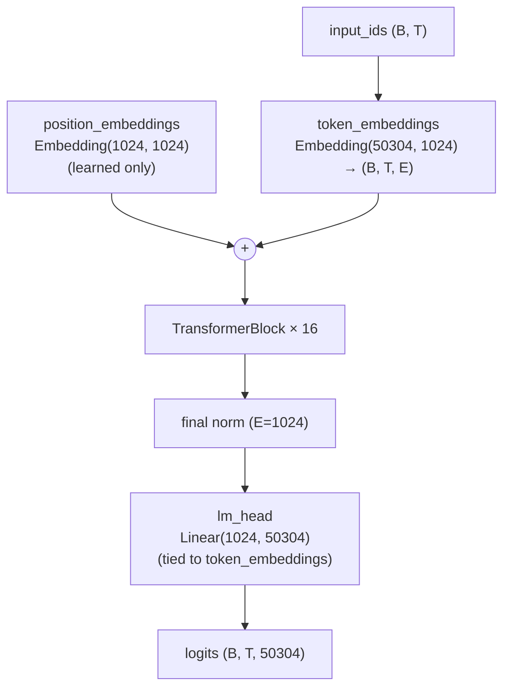
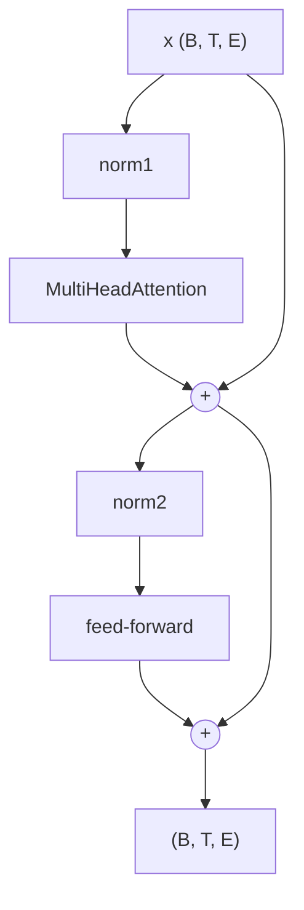
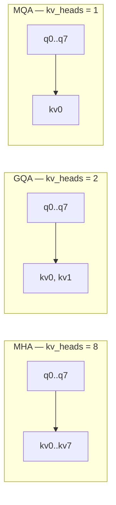
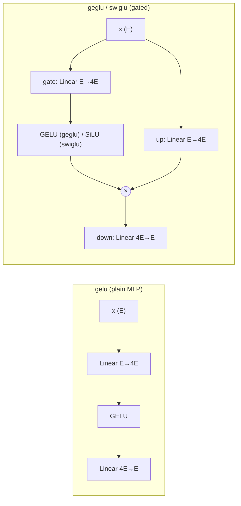

# Architecture

LLM Toaster trains a **dense, decoder-only Transformer** (GPT/LLaMA-style): pre-norm residual
blocks, causal self-attention, a feed-forward block, tied input/output embeddings by default, and
GPT-2 style weight init (so training starts near `ln(vocab)`). Every architectural choice is a
config field (see the [README options table](../README.md#model-architecture--options)), so a study
can vary **one axis at a time**.

Diagrams below use the **default config** for concrete numbers
(`n_embd=E=1024`, `n_head=8`, `head_dim=128`, `n_blocks=16`, `vocab=50304`, `seq_len=1024`). `B`/`T`
are batch/sequence at runtime. For an exact, auto-generated card for *any* config (with a parameter
table), run:

```bash
python scripts/describe_arch.py --config config/default_config.yaml
```

## Model dataflow



With `position: rope` or `none`, the learned `position_embeddings` table is dropped (RoPE injects
position inside attention; `none` uses no positional signal).

## Decoder block (pre-norm, ×16)



Residual output projections (attention `o_proj`, FFN down-projection) are flagged
`_is_residual_projection` and initialised with std `0.02 / sqrt(2·n_blocks)` to keep the residual
stream stable with depth.

## Attention: MHA → GQA → MQA (`model.num_key_value_heads`)

All queries use `n_head` heads; **key/value heads are shared** to shrink the KV-cache — the dominant
inference-memory cost on-device. Query heads map onto KV heads in groups.



KV-cache per token (fp16) = `2 · n_blocks · kv_heads · head_dim · 2 bytes`. For the default dims:

| variant | `kv_heads` | KV-cache/token | @ seq_len=1024 |
| --- | ---: | ---: | ---: |
| MHA | 8 | 64 KB | 64 MB |
| GQA | 2 | 16 KB | 16 MB |
| MQA | 1 | 8 KB | 8 MB |

**RoPE** (`position: rope`) rotates query/key pairs by position-dependent angles (rotate-half
convention) before attention; it requires an even `head_dim` and adds no parameters.

## Feed-forward variants (`model.ffn`, width `model.ffn_mult · E`)



Gated FFNs (GEGLU/SwiGLU) carry an extra input projection, so at equal `ffn_mult` they have **more
parameters** than the plain GELU MLP. Architecture comparisons therefore equalise *total*
parameters with the matched-parameter solver (`toaster/models/sizing.py`), not equal `ffn_mult`.

## Normalization (`model.norm`)

- **LayerNorm**: per-token mean+variance normalize, `weight` + `bias` (2·E params).
- **RMSNorm**: root-mean-square normalize, `weight` only (E params) — cheaper, no mean subtraction.

## Reference: default config parameter breakdown

254.1M params total (≈ 969 MB fp32 / 485 MB fp16):

| component | params | % |
| --- | ---: | ---: |
| token_embeddings (tied to lm_head) | 51.5M | 20.3% |
| position_embeddings (learned) | 1.0M | 0.4% |
| attention ×16 | 67.2M | 26.4% |
| feed_forward ×16 | 134.3M | 52.9% |
| norms ×16 + final | ~0.07M | 0.0% |
| **total** | **254.1M** | **100%** |

Compute ≈ 1.72 GFLOP/token (training fwd+bwd). For small models the embedding table is a large
share of parameters and memory — a real lever for on-device deployment (vocab size, tied embeddings).

## Not implemented (rejected at config load)

MoE FFN, sliding-window attention, `flash_attn_2`/`xformers` backends, SentencePiece tokenizer, and
non-`none` `distributed.backend` — `ConfigHandler.validate()` raises a clear `NotImplementedError`
rather than silently pretending to support them.
